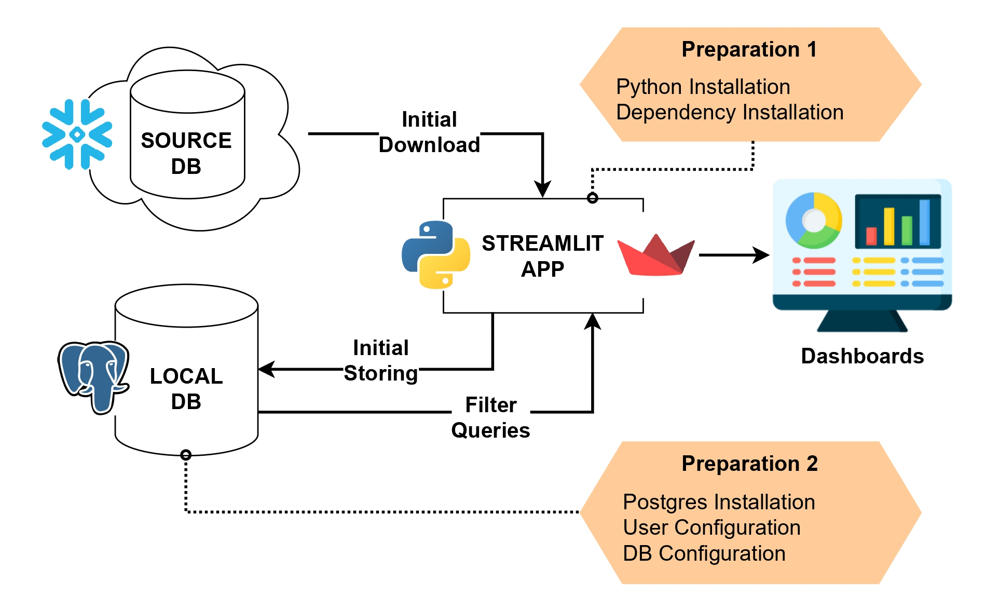
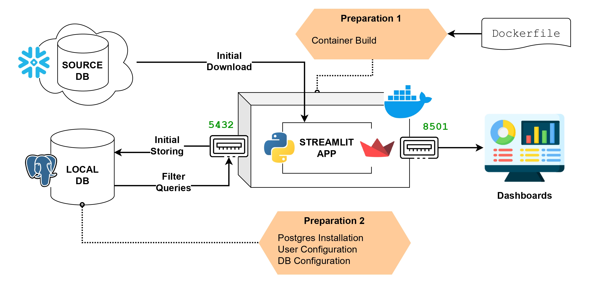
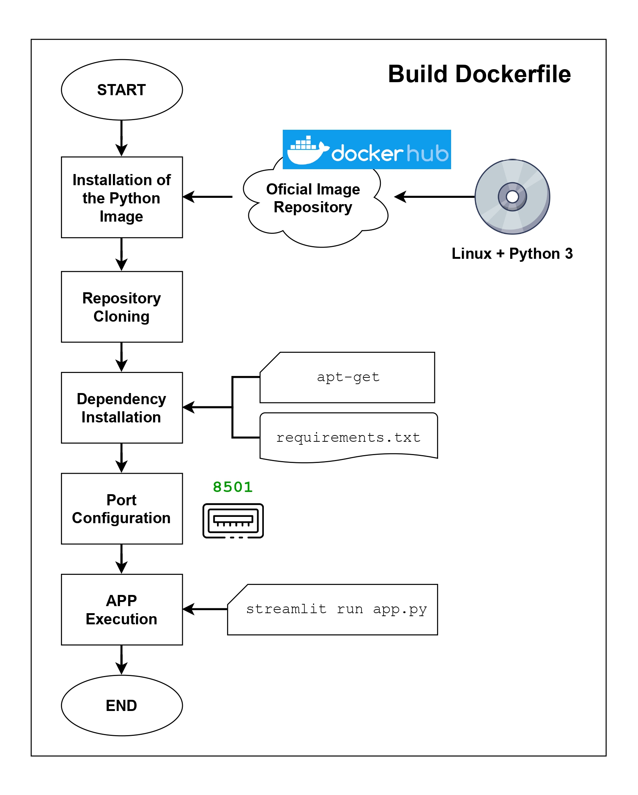
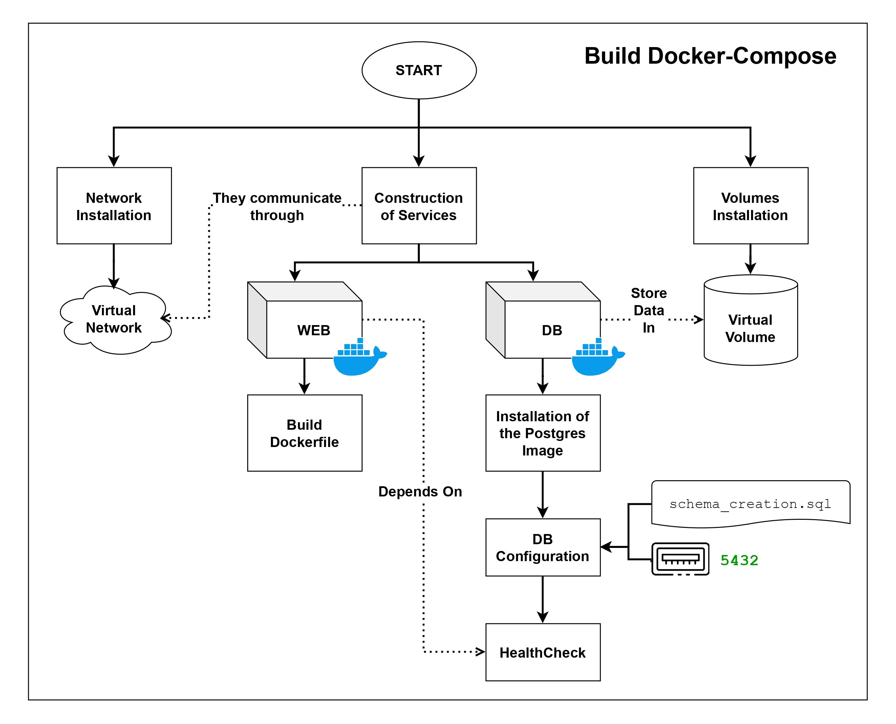

# Streamlit IMDB Dashboard

This project consists of a basic Streamlit application, that collects data from a Snowflake data warehouse, to display a series of interactive dashboards built with the Plotly library.

When the user loads a dashboard, the data is downloaded from the Snowflake account and stored in a local PostgresSQL database. This database is used to perform filtering, which is executed each time the user updates the interface filters.

The application runs thanks to 2 Docker containers: one for the Streamlit web and one for the local bd.

# Table of Contents

- [Streamlit IMDB Dashboard](#streamlit-imdb-dashboard)
- [Table of Contents](#table-of-contents)
- [Project Setup](#project-setup)
  - [Data origin](#data-origin)
  - [Snowflake Configuration](#snowflake-configuration)
  - [Data transformation and upload to Snowflake](#data-transformation-and-upload-to-snowflake)
  - [Setting the Local PostgreSQL](#setting-the-local-postgresql)
  - [Environmental Variables](#environmental-variables)
- [Streamlit App](#streamlit-app)
  - [App Files](#app-files)
  - [Launching the App](#launching-the-app)
    - [Configuration 1: Local Installation of the App and DB](#configuration-1-local-installation-of-the-app-and-db)
    - [Configuration 2: Streamlit on Docker and DB in the localhost](#configuration-2-streamlit-on-docker-and-db-in-the-localhost)
    - [Configuration 3: App and DB running on Docker containers](#configuration-3-app-and-db-running-on-docker-containers)
  - [Testing the App](#testing-the-app)
- [CI/CD with GitHub Actions](#cicd-with-github-actions)

# Project Setup

## Data origin

The data stored in Snowflake comes from a Kaggle dataset in .csv format, which can be found at the following link:
[IMDB Movies Dataset](https://www.kaggle.com/datasets/yusufdelikkaya/imdb-movie-dataset)

- Although it has only 1000 rows, this dataset has a sufficient number and variety of columns to build a basic star model.
- The original .csv file, can be found inside the repository in the following route:

> ./datasets/imdb_dataset.csv

## Snowflake Configuration

To configure the Snowflake Account with all the necessary components and restrictions for the project, a sql script was included in the Scripts folder:

> ./scripts/snow_configuration.sql

This script is intended to be executed section by section, rather than all at once, and requires Enterprise Edition or higher to run all the queries.
If this is not possible, the Access Policy cannot be executed, but it is not necessary for the app's execution.

The implemented configurations include:
* Database, Schema and Warehouse creation
* Creation of the role USERIMDB and the users IMDB_USER_1 and IMDB_USER_2, along with their permissions
* Creation of the role TEST_USERIMDB and the user TEST_USER for testing the connections of the app
* Creation of a Resource Monitor and Access Policy

## Data transformation and upload to Snowflake

To create the star model, the data has been transformed using a python script, which can be found at:

> ./scripts/data_transformation.py

To upload the data to snowflake, another python script has been used, which makes use of the official Snowflake connector for this language: [Snowflake Connector for Python](https://docs.snowflake.com/en/developer-guide/python-connector/python-connector)

> ./scripts/load_into_snow.py

In turn, this script uses another SQL script to generate the schema:

> ./scripts/schema_creation.sql

> **IMPORTANT**: Before uploading the data to Snowflake, the database “PRACTICE_DATASETS” and the schema “IMDB_DWH” must be created, wich can be archieved
> using the script in the [Snowflake Configuration section](#snowflake-configuration).

## Setting the Local PostgreSQL

This project uses a local database in Postgres, to cache the data downloaded from Snowflake, wich allowsto filter the dashboard data against this DB.

Here is a list of commands used to configure this DB:

* Check if the command Postgres command works: 
> psql --version

* Create database (only executed 1 time):
> psql -U postgres \
CREATE DATABASE practice_datasets; \
ALTER DATABASE practice_datasets SET client_encoding TO 'UTF8'; \
\q

* Schema creation (can be executed several times):
> psql -U postgres -f schema_creation_psql.sql

* The next commands can be used to check the results (use "psql -U postgres" to enter the Postgres console):
    * List all databases:
        > \l
    * Connect to the database:
        > \c practice_datasets
    * Show all schemas in database:
        > \dn
    * Show all tables in schema:
        > SELECT * from pg_tables where schemaname='imdb_dwh';
    * Terminate active connections:
        > SELECT pg_terminate_backend(pg_stat_activity.pid) FROM pg_stat_activity WHERE pg_stat_activity.datname = 'practice_datasets' AND pid <> pg_backend_pid();
    * Drop database
        > DROP DATABASE practice_datasets WITH (FORCE);
    
    ---

**NOTE**: To use the psql command in Windows, it is necessary to add the next path to the Environmental Variable PATH, and executing it as Admin:
> <Installation folder>\PostgreSQL\<version>\bin\

## Environmental Variables

Both the Streamlit App and the Docker Configuration use environmental variables to access critical data, such as the credentials of the local database and Snowflake. The easiest way to configure these variables is by using a .env file (not included in the GitHub repository), which is also needed in Python to load them.

A template of what needs to be included in this file, can be found in:

> scripts/dotenv_template.txt

These variables were also configured for the [GitHub Actions pipeline](#cicd-with-github-actions), using GitHub Secrets and GitHub Variables.

# Streamlit App

## App Files

Here´s a list of all the files used in the Streamlit App:

* **./app.py** - Contains the app and log configuration
* **./global_parameters.py** - Configures the global variables and keys used in Streamlit
* **./utilities_** - Python scripts used to separate the app code:
    * **./utilities_db_connections.py** - It has all the functions used to manage connections to the Snowflake account and the local Postgres
    * **./utilities_data.py** - It contains the functions needed to transform the data with Pandas
    * **./utilities_navigation.py** - It has the functions used to control the navigation in the app
    * **./utilities_graphs.py** - It contains functions to draw graphs from Pandas dataframes using Plotly.
* **./pages/** - This folder contains the python scripts used to configure the pages of the app: 
    * **./pages/st_login.py** - Login Page
    * **./pages/st_dashboard_year_state.py** - First Dashboard
    * **./pages/st_dashboard_top_data.py** - Second Dashboard
    * **./pages/st_sidebar.py** - The sidebar used to filter the data of the dashboards

The next diagram shows the interaction between these files:

>**NOTE**: When the app is running, it saves the logs in a app.log file

## Launching the App

The Streamlit App can be launched in 3 different ways, dependind of the Docker configuration.

Once launched, the application can be visited at the following link:
[localhost:8501](localhost:8501/)

### Configuration 1: Local Installation of the App and DB

With this setting, the app and the db are running in the localhost, without the intervention of any Docker container. 

This configuration requires the installation of:
* Python
* Python dependencies:
> pip install -r ./requirements.txt
* PostgreSQL
* Local DB and it´s configuration: explained in another [section](#setting-the-local-postgresql)

The app can be launched with the next command:
> streamlit run app.py

### Configuration 2: Streamlit on Docker and DB in the localhost

In this case, the App is running inside a Docker container while the db is still installed in the local system.

For this setting, the **Dockerfile** is needed to configure all the steps that the container has to execute in the launch. The next diagram shows these steps:

This configuration requires the installation of:
* Docker (in Windows it´s better to install [Docker Desktop](https://docs.docker.com/desktop/setup/install/windows-install/))
* PostgreSQL
* Local DB and it´s configuration: explained in another [section](#setting-the-local-postgresql)

The app can be launched with the next commands:
* Build the Docker image
> docker build -t st-dashboard-conf2 .

* Run the Docker container
> docker run --name st-dashboard-conf2-container -p 8501:8501 -it st-dashboard-conf2

---
> **IMPORTANT**: Admin privileges needed (best option is execute them from the Docker Desktop console): \
cd <proyect_path>

### Configuration 3: App and DB running on Docker containers

In this case, the App and the Postgres DB are running inside two separate Docker containers, so there is no need for additional configurations (Python and PostgreSQL are not required to be installed in the local system).

For this setting, the **docker-compose.yml** is needed to configure the launch of the two containers (along with the Dockerfile used to launch the app container). The next diagram shows how this works:

This configuration only requires the installation of:
* Docker (in Windows it´s better to install [Docker Desktop](https://docs.docker.com/desktop/setup/install/windows-install/))
* docker-compose (comes with Docker Desktop)

The app can be launched with the next commands:
* Build and run the containers
> docker-compose up --build

* Stop the two containers
> docker-compose down

---
> **IMPORTANT**: Admin privileges needed (best option is execute them from the Docker Desktop console): \
cd <proyect_path>

## Testing the App

Another python script is included in order to test the connections to both Snowflake and PostgreSQL.

These tests can be executed with the next command:
> python -m unittest discover

# CI/CD with GitHub Actions

A .yml file was added to create a pipeline in GitHub Actions, wich is executed each time a push is made to the develop branch. 

This workflow launches the app and the db with docker-compose ([Configuration 3](#configuration-3-app-and-db-running-on-docker-containers)) and executes the [tests](#testing-the-app). If nothing fails, the two builded Docker images are saved into the GitHub Container Registry.

These images can be downloaded from the [packages section](https://github.com/dfernasu?tab=packages&repo_name=streamlit-imdb-dashboard) of the repository.

The next diagram shows the steps made in the pipeline:

